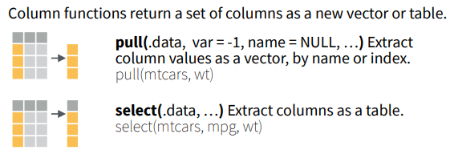
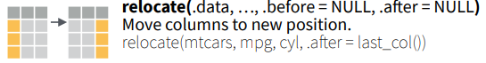
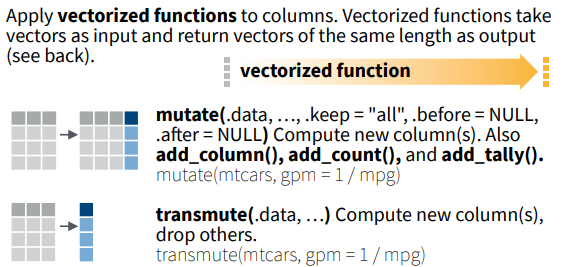
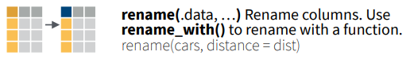
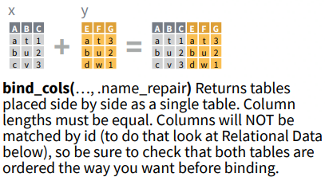

# 3 Manipulating Columns

| Select columns | `select()`, `pull()`
| Arrange columns | `relocate()`, `select()`
| Add columns | `mutate()`, `transmute()`, `bind_cols()`
| Rename columns | `rename()`

Please copy the following code and paste them into a script in the RStudio. We will walk through them with the visual explanations from the dplyr cheat sheet.

Input
{: .label .label-green}
```r
# Sample code from the dplyr cheat sheet
## 3.1 Select columns
pullmt=pull(mtcars, wt)
selectmt=select(mtcars, mpg, wt)

## 3.2 Arrange columns
relocatemt=relocate(mtcars, mpg, cyl, .after = last_col())

## 3.3 Add columns
mutmt=mutate(mtcars, gpm = 1 / mpg)
tmt=transmute(mtcars, gpm = 1 / mpg)

### A showcase for bind_cols
x <- data.frame(
  A = c('a', 'b', 'c'), 
  B = c('t', 'u', 'v'),
  C = c(1, 2, 3))
x
y <- data.frame(
  E = c('a', 'b', 'd'), 
  G = c('t', 'u', 'w'), #skip F because F = FALSE, so it's best not to use that letter.
  H = c(3, 2, 1))
y
# You have to make sure the binding is meaningful by yourself. 
# This is not the same as joins
bind_cols(x, y) 

## 3.4 Rename columns
rename(cars, distance = dist)
```

## Visual walkthrough

### Select columns: `select()` and `pull()`


What to notice: these functions keep only the columns you ask for, which narrows your data to relevant variables.

### Arrange columns: `relocate()`


What to notice: this changes column order only; rows and values stay the same.

### Add columns: `mutate()` and `transmute()`


What to notice: `mutate()` adds new columns while keeping existing ones, but `transmute()` keeps only new columns.

### Rename columns: `rename()`


What to notice: only the column names change; the data inside each column does not.

### Combine columns from multiple data frames: `bind_cols()`


What to notice: `bind_cols()` joins data by row position, so use it only when rows correspond correctly.

## Practice 2
`iris` is a data frame with 150 cases (rows) and 5 variables (columns) named `Sepal.Length`, `Sepal.Width`, `Petal.Length`, `Petal.Width`, and `Species`. Make a new data frame which contains only `Species` and the ratio of `Petal.Width` and `Petal.Length`.
<details><summary><strong> click here for solution </strong></summary>

<pre>
my_iris1_base_pipe <- iris |>
  mutate(Petal.Width.Length.Ratio = Petal.Width / Petal.Length) |>
  select(Species, Petal.Width.Length.Ratio)
</pre>

</details>
&nbsp;    
&nbsp;    


This page is meant to introduce functions that help manipulate columns.  
