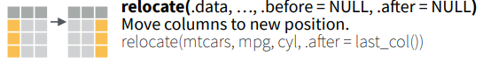

# 3 Manipulating Columns

| Select columns | `select()`, `pull()`
| Arrange columns | `relocate()`, `select()`
| Add columns | `mutate()`, `transmute()`, `bind_cols()`
| Rename columns | `rename()`

Please copy the following code and paste them into a script in the RStudio. We will walk through them with the visual explanations from the dplyr cheat sheet.

Input
{: .label .label-green}
```r
# Sample code from the dplyr cheat sheet
## 3.1 Select columns
pull(mtcars, wt)
select(mtcars, mpg, wt)

## 3.2 Arrange columns
relocate(mtcars, mpg, cyl, .after = last_col())

## 3.3 Add columns
mutate(mtcars, gpm = 1 / mpg)
transmute(mtcars, gpm = 1 / mpg)
### A showcase for bind_cols
x <- data.frame(
  A = c('a', 'b', 'c'), 
  B = c('t', 'u', 'v'),
  C = c(1, 2, 3))
x
y <- data.frame(
  E = c('a', 'b', 'd'), 
  F = c('t', 'u', 'w'),
  G = c(3, 2, 1))
y
bind_cols(x, y) # you have to make sure the binding is meaningful by yourself

## 3.4 Rename columns
rename(cars, distance = dist)
```


## 3.1 Select Columns 

<div style="text-align: right">
	<p>Figure Source: <a href="https://raw.githubusercontent.com/rstudio/cheatsheets/main/data-transformation.pdf">dplyr Cheat Sheet</a>, CC BY SA Posit Software, PBC</p>
</div>

## 3.2 Arrange Columns

<div style="text-align: right">
	<p>Figure Source: <a href="https://raw.githubusercontent.com/rstudio/cheatsheets/main/data-transformation.pdf">dplyr Cheat Sheet</a>, CC BY SA Posit Software, PBC</p>
</div>

## 3.3 Add Columns


<div style="text-align: right">
	<p>Figure Source: <a href="https://raw.githubusercontent.com/rstudio/cheatsheets/main/data-transformation.pdf">dplyr Cheat Sheet</a>, CC BY SA Posit Software, PBC</p>
</div>

## 3.4 Rename Columns

<div style="text-align: right">
	<p>Figure Source: <a href="https://raw.githubusercontent.com/rstudio/cheatsheets/main/data-transformation.pdf">dplyr Cheat Sheet</a>, CC BY SA Posit Software, PBC</p>
</div>

## Practice 3
`iris` is a data frame with 150 cases (rows) and 5 variables (columns) named `Sepal.Length`, `Sepal.Width`, `Petal.Length`, `Petal.Width`, and `Species`. Make a new data frame which contains only `Species` and the ratio of `Petal.Width` and `Petal.Length`.
<details>
	<summary><u>Click here for solution</u></summary>
	<div style="border: thin grey 1px; background-color: #eeebee; padding:15px;">
		<p>
		my_iris1 <- mutate(iris, Petal.Width.Length.Ratio = Petal.Width/Petal.Length) <br>
		select(my_iris1, Species, Petal.Width.Length.Ratio)
		</p>
    </div>
</details>
&nbsp;    
&nbsp;    


This page is meant to introduce functions that help manipulate columns.  
A pause here for questions.