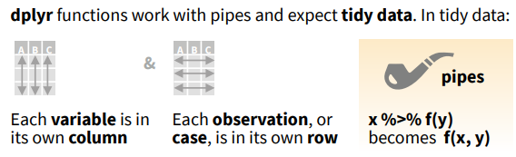

# 1 Introduction to *dplyr*

## 1.1 What is *dplyr*?

> "A Grammar of Data Manipulation: a fast, consistent tool for working with data frame like objects, both in memory and out of memory."
<div style="text-align: right">
	<p><a href="https://cran.r-project.org/web/packages/dplyr/dplyr.pdf">R document (r-project.org)</a></p>
</div>

> "A grammar of data manipulation, providing a consistent set of verbs that help you solve the most common data manipulation challenges"
<div style="text-align: right">
	<p><a href="https://dplyr.tidyverse.org/">dplyr (tidyverse.org)</a></p>
</div>

> "A part of the tidyverse meta-package and, as a core package, it is among those loaded via `library(tidyverse)`".
<div style="text-align: right">
	<p><a href="https://stat545.com/dplyr-intro.html">Introduction to dplyr in STAT 545</a></p>
</div>


## Practice 1
In order to be able to use the functions from the `dplyr` package, let's (install and) load it first.

Input
{: .label .label-green}
```r
if(!require(tidyverse)) # checks if package can be loaded
  { # if not, install and then load
  install.packages("tidyverse") # install package
  library(tidyverse) # load package 
  }
```

<details>
	<summary><u>Click here for outputs</u></summary>
	<div style="border: thin grey 1px; background-color: #eeebee; padding:15px;">
		<p>If package already installed and can be loaded:</p>
	    
	    <br/>
	    <p>If package not installed:</p>
	    
    </div>
</details>


## 1.2 Tidy data and pipes


<div style="text-align: right">
	<p>Figure Source: <a href="https://raw.githubusercontent.com/rstudio/cheatsheets/main/data-transformation.pdf">dplyr Cheat Sheet</a></p>
</div>
&nbsp;    
&nbsp;    


This page is meant to introduce the dplyr package briefly and get you ready move on to learn functions from dplyr.  
A pause here for questions.