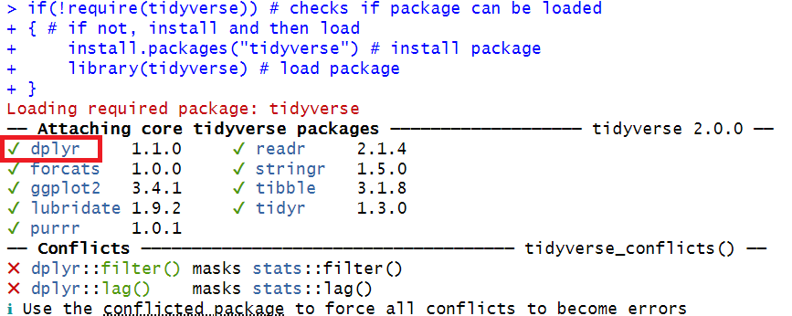
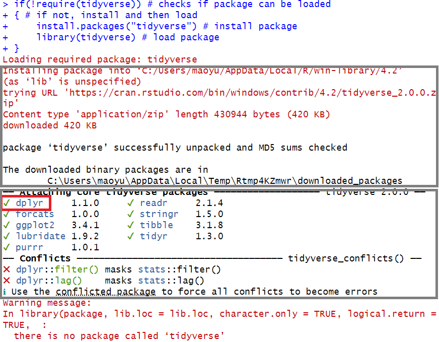
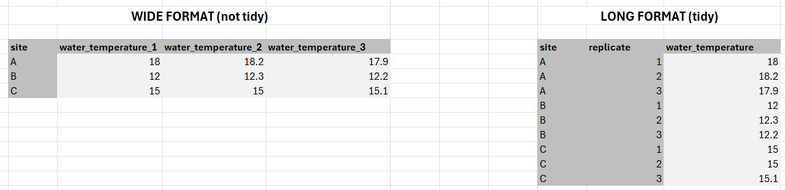

# 1 Introduction to *dplyr*

## 1.1 What is *dplyr*?

A part of the tidyverse meta-package that facilitates data manipulation.
As with all other tidyverse pacakges, dplyr has <a href="https://dplyr.tidyverse.org/" target="_blank">extensive documentation</a> and <a href="https://www.rstudio.com/wp-content/uploads/2015/02/data-wrangling-cheatsheet.pdf" target="_blank">cheat sheets</a> available


## Package installation and loading
In order to be able to use the functions from the `dplyr` package, let's (install and) load it first.

Input
{: .label .label-green}
```r
if(!require(tidyverse)) # checks if package can be loaded
  { # if not, install and then load
  install.packages("tidyverse") # install package
  library(tidyverse) # load package 
  }
```

<details>
	<summary><u>Click here for outputs</u></summary>
	<div style="border: thin grey 1px; background-color: #eeebee; padding:15px;">
		<p>If package already installed and can be loaded:</p>
	    
	    <br/>
	    <p>If package not installed:</p>
	    
    </div>
</details>


## 1.2 Tidy data and pipes

Tidy data is data that has been cleaned AND that is in the correct format for data analysis. Usually, it is best to have the data in a "long format" because of how code has to be written for data analysis.

<div style="margin-left: 5%; margin-top: 20px; margin-bottom: 60px">

</div>

The pipe operator `%>%` takes the thing on its left side and feeds that to its right side. You can read it as "then".

The use of pipe operator is based on some patterns shared by most of the functions from the dplyr package:
* The input is a data frame, which is usually the first argument for a function.
* The output is also a data frame.  

Therefore, you can pass on the output from a function as input for the next function.


Note: you can use CTRL+Shift+M (PC) or CMD+Shift+M (Mac) as a keyboard shortcut for `%>%`. If you use the keyboard shortcut, your pipe will look like this `|>`.

Getting grouped summaries is a common data exploration task, and it usually requires multiple steps. For example, in the dplyr cheat sheet, the following sample code first group the cases in `mtcars` data by the `cyl` variable, i.e., group the cars by number of cylinders, and then calculate the average `mpg` miles per gallon for each group. 

Input
{: .label .label-green}
```r
# without using pipes - operations are nested
newmtcars = summarise(group_by(mtcars, cyl), avg = mean(mpg))

# with pipes - easier to read because each command is separated and in order
newmtcars = mtcars %>% 
  group_by(cyl) %>%
  summarise(avg = mean(mpg))


```


This page is meant to introduce the dplyr package briefly and get you ready move on to learn functions from dplyr.  
