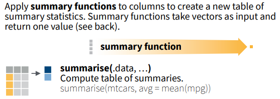
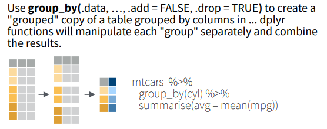

# 4 Combining Multiple Manipulations 

## 4.1 Grouped Summaries

Getting grouped summaries is a common data exploration task, and it usually requires multiple steps. For example, in the dplyr cheat sheet, the following sample code first group the cases in `mtcars` data by the `cyl` variable, i.e., group the cars by number of cylinders, and then calculate the average `mpg` miles per gallon for each group. 

Input
{: .label .label-green}
```r
# Sample code from the dplyr cheat sheet
## 4.1 Grouped summaries
mtcars %>%
  group_by(cyl) %>%
  summarise(avg = mean(mpg))
```



<div style="text-align: right">
	<p>Figure Source: <a href="https://raw.githubusercontent.com/rstudio/cheatsheets/main/data-transformation.pdf">dplyr Cheat Sheet</a>, CC BY SA Posit Software, PBC</p>
</div>


## 4.2 Pipe Operator

The pipe operator `%>%` takes the thing on its left side and feeds that to its right side. You can read it as "then".
Note: you can use CTRL+Shift+M (PC) or CMD+Shift+M (Mac) as a keyboard shortcut for `%>%`. 

Without pipe operators, multi-operation commands will be nested like Russian nesting dolls. For example, the following code does the same thing as the previouse code, but harder to write and read.

Input
{: .label .label-green}
```r
summarise(group_by(mtcars, cyl), avg = mean(mpg))
```

The use of pipe operator is based on some patterns shared by most of the functions from the dplyr package:
* The input is a data frame, which is usually the first argument for a function.
* The output is also a data frame.  

Therefore, you can pass on the output from a function as input for the next function.

## Practice 4
In the solution for practice 3, intermediate results were used to do multiple manipulations. Please simplify the solution with the pipe operator, further group the results by species, and summarise the average petal width length ratio.
<details>
	<summary><u>Click here for solution</u></summary>
	<div style="border: thin grey 1px; background-color: #eeebee; padding:15px;">
		<p>
		iris %>% <br>
          mutate(Petal.Width.Length.Ratio = Petal.Width/Petal.Length) %>% <br>
          select(Species, Petal.Width.Length.Ratio) %>% <br>
          group_by(Species) %>% <br>
          summarise(ave_ratio = mean(Petal.Width.Length.Ratio))
		</p>
    </div>
</details> 
&nbsp;    
&nbsp;    


This page is meant to introduce the pipe operator that helps combine multiple manipulations.  
A pause here for questions.
