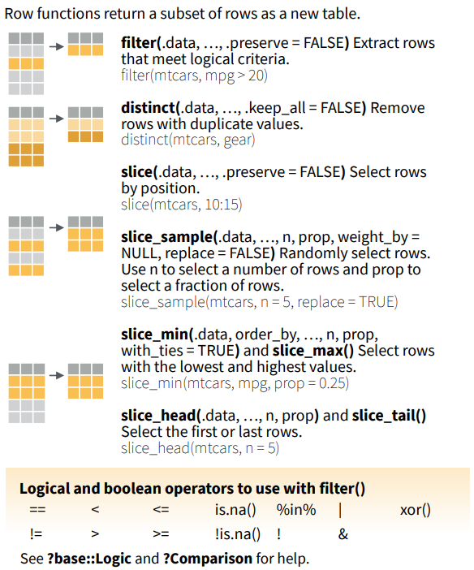
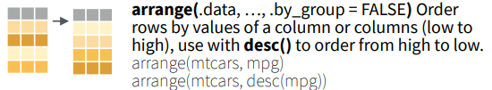
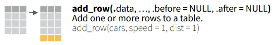
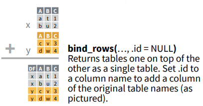

# 2 Manipulating Rows

| Select rows | `filter()`, `distinct()`, `slice()` family
| Arrange rows | `arrange()`
| Add rows | `add_row()`, `bind_rows()`

Please copy the following code and paste them into a script in the RStudio. We will walk through them with the visual explanations from the dplyr cheat sheet.

Input
{: .label .label-green}
```r
# make sure you loaded the tidyverse libeary
library(tidyverse)

# Get to know the data
?mtcars
mtcars

# Sample code from the dplyr cheat sheet
## 2.1 Select cases
filter(mtcars, mpg > 20)
distinct(mtcars, gear)
slice(mtcars, 10:15)
slice_sample(mtcars, n = 5, replace = TRUE)
slice_min(mtcars, mpg, prop = 0.25)
slice_max(mtcars, mpg, prop = 0.25)
slice_head(mtcars, n = 5)
slice_tail(mtcars, n = 5)

## 2.2 Arrange cases
arrange(mtcars, mpg)
arrange(mtcars, desc(mpg))

## 2.3 Add cases
add_row(cars, speed = 1, dist = 1)
### A showcase for bind_rows
x <- data.frame(
  A = c('a', 'b'), 
  B = c('t', 'u'),
  C = c(1, 2))
x
y <- data.frame(
  A = c('c', 'v'), 
  B = c('d', 'w'),
  D = c(TRUE, FALSE))
y
bind_rows(x, y)
```

## 2.1 Select Cases

<div style="text-align: right">
	<p>Figure Source: <a href="https://raw.githubusercontent.com/rstudio/cheatsheets/main/data-transformation.pdf">dplyr Cheat Sheet</a>, CC BY SA Posit Software, PBC</p>
</div>

## 2.2 Arrange Cases

<div style="text-align: right">
	<p>Figure Source: <a href="https://raw.githubusercontent.com/rstudio/cheatsheets/main/data-transformation.pdf">dplyr Cheat Sheet</a>, CC BY SA Posit Software, PBC</p>
</div>

## 2.3 Add Cases


<div style="text-align: right">
	<p>Figure Source: <a href="https://raw.githubusercontent.com/rstudio/cheatsheets/main/data-transformation.pdf">dplyr Cheat Sheet</a>, CC BY SA Posit Software, PBC</p>
</div>

## Practice 2
`iris` is a data frame with 150 cases (rows) and 5 variables (columns) such as `Petal.Width` and `Species`. In the `iris` data set, the cases with the minimum and maximum petal width belong to what species?
<details>
	<summary><u>Click here for solutions</u></summary>
	<div style="border: thin grey 1px; background-color: #eeebee; padding:15px;">
		<p>
		# solution 1 <br>
		arrange(iris, Petal.Width) <br>
		# solution 2 <br>
		slice_min(iris, Petal.Width, prop = 0.01) <br>
		slice_max(iris, Petal.Width, prop = 0.01) <br>
		 <br>
		# The case with the minimum petal width belongs to setosa. <br>
		# The case with the maximum petal width belongs to virginica.
		</p>
    </div>
</details>
&nbsp;    
&nbsp;    


This page is meant to introduce functions that help manipulate rows.  
A pause here for questions.


