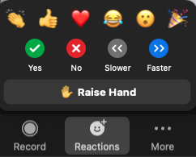

# Participating online
Active participation enlivens the session with other voices and perspectives. We encourage you to engage with instructors and with each other.

Microphones are muted by default to improve audio quality.

Recording is enabled and will be available to everyone who registered for the workshop.
 

The Zoom toolbar provides several ways to be part of the conversation:

 

## Chat window
Use the _Chat_ window to comment or ask a question at any time. Instructors will do their best to respond, sometimes waiting for a break in the lesson to do so.

The _Chat_ window is a good place to report problems with your audio connection. Instructors may also use it to share links to material mentioned in the session.
 

## Reactions menu 
Open the _Reactions_ menu and click an icon to communicate with the instructors.

Use this to **answer yes/no** questions or to **raise your hand** when instructors invite you to ask a question, comment, or share your screen.
 

## Share your screen
In some cases instructors may invite you to share your screen. Raise your hand to indicate that you're ready to share. When called upon click _Share screen_, select a window to display, and click _Share_.
 

